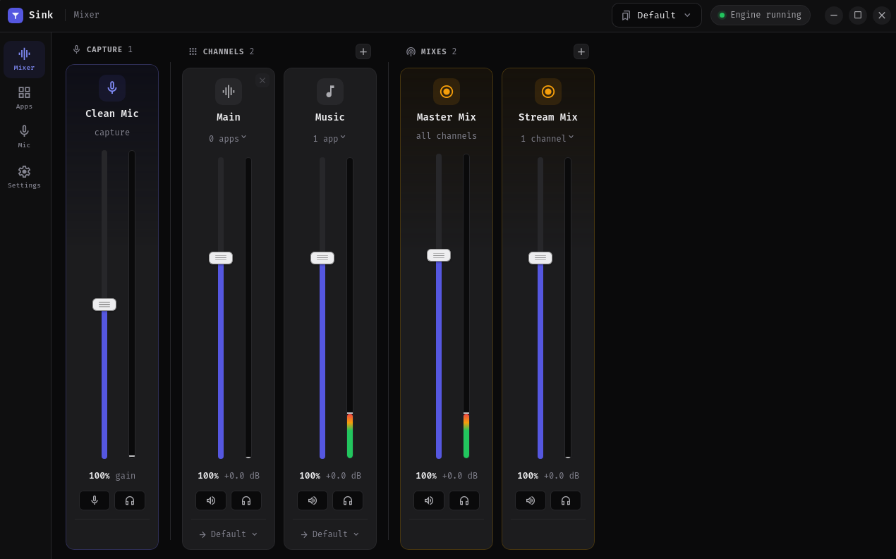
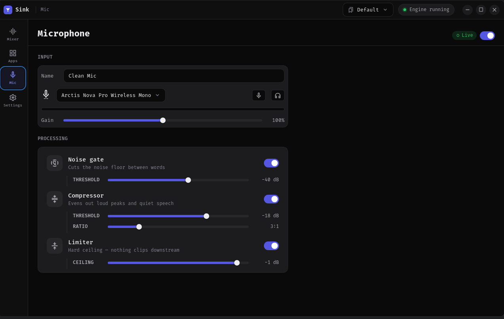
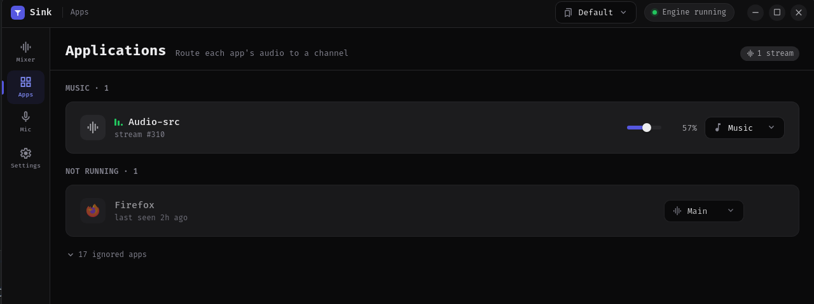

# Sink

<!-- social-badges:start -->
[](https://discord.gg/jUMuSxGf6q)
[](https://github.com/NC1107)
[](https://patreon.com/NPC1107)
<!-- social-badges:end -->

SteelSeries Sonar for Linux. Built on PipeWire.

Route each app to its own channel — Game, Chat, Music — and control
volume, mute, and output device per channel. Build mixes for OBS and a
processed virtual microphone for voice chat.



```
 apps ─► channels ─► your ears
              └────► a Mix ─► OBS / recorder
```

## Features

- **Channels** — per-app routing with volume, mute, meters, and a choice
  of output device per channel
- **Apps** — running apps appear automatically; assign once, remembered
  forever
- **Mixes** — recordable sources for OBS. Master Mix carries everything;
  custom mixes can carry "everything except music" and stay current as
  channels change. In OBS, add a mix as an audio input — not Desktop Audio.
- **Microphone** — noise gate, compressor and limiter into a virtual mic
  you select in Discord or OBS. Pairs well with
  [NoiseTorch](https://github.com/noisetorch/NoiseTorch) on the input for
  noise suppression before the chain.
- **Profiles** — save and switch full layouts from the tray




## Install

**Arch / Manjaro / EndeavourOS** - from the [AUR](https://aur.archlinux.org/packages/sink-bin):

```bash
yay -S sink-bin      # or: paru -S sink-bin
```

**Fedora** - from [COPR](https://copr.fedorainfracloud.org/coprs/nc1107/sink/):

```bash
sudo dnf copr enable nc1107/sink
sudo dnf install sink
```

Both track new releases, so you update through your package manager like any
other package.

Otherwise, grab the latest from [Releases](https://github.com/NC1107/sink/releases)
and install the file directly:

**Fedora / openSUSE**

```bash
sudo dnf install ./sink-*.x86_64.rpm
```

**Debian / Ubuntu / Mint**

```bash
sudo apt install ./sink_*_amd64.deb
```

**Arch / Manjaro / EndeavourOS**

```bash
sudo pacman -U ./sink-bin-*-x86_64.pkg.tar.zst
```

These install the app properly - launcher entry, icon, uninstall
through your package manager.

**Any other distro - AppImage (portable, no root)**

```bash
chmod +x sink_*_amd64.AppImage
./sink_*_amd64.AppImage
```

To get a launcher entry for an AppImage, use
[Gear Lever](https://flathub.org/apps/it.mijorus.gearlever) or
AppImageLauncher.

Requires PipeWire with `pipewire-pulse` and WirePlumber 0.5+ (the default
on most current distros).

## Build

```bash
npm install
npm run tauri dev      # run
npm run tauri build    # package
```

Config lives in `~/.config/sink` as plain JSON.

## License

[GPL-3.0](LICENSE)
